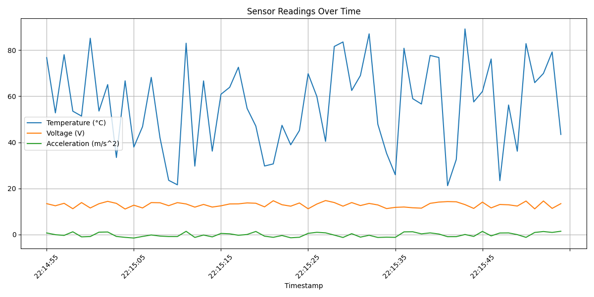

#  Sensor Telemetry Simulator

This project simulates telemetry data from 3 robot sensors: temperature, voltage, and acceleration. It logs time-series data, triggers alerts for out-of-bounds readings, and visualizes trends using Matplotlib.

##  Features

- Simulates realistic sensor readings
- Logs data to `sensor_log.csv`
- Triggers alerts for:
  - High temperature (> 75°C)
  - Low voltage (< 11.5V)
  - High acceleration (>|1.3| m/s²)
- Generates `sensor_plot.png` with sensor trends

##  Tech Stack

- Python
- Pandas
- Matplotlib

##  Output Example

